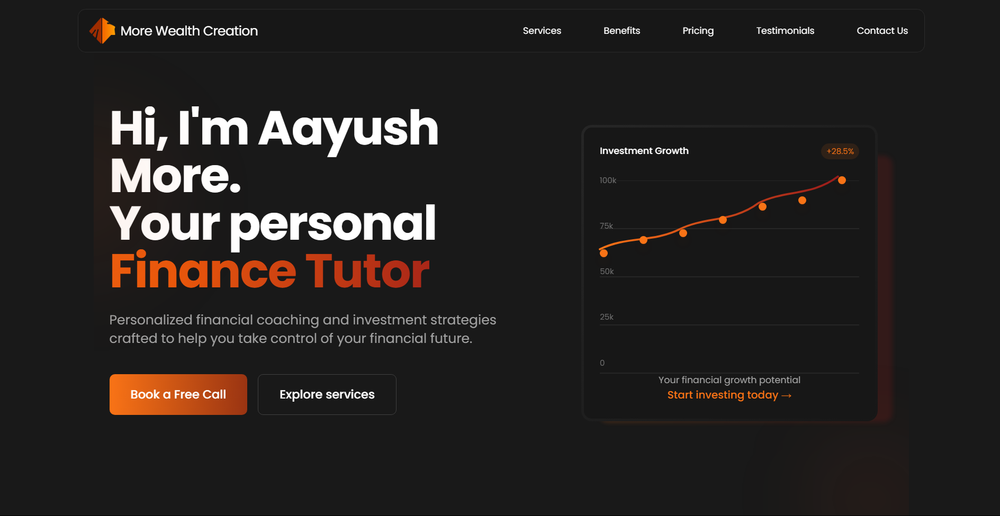
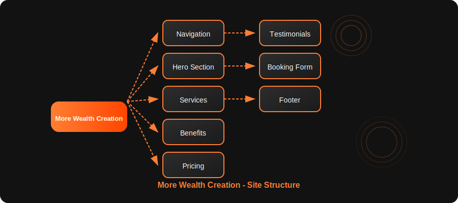

# More Wealth Creation - Finance Tutor Landing Page

A modern, animated, and responsive landing page built for a finance tutor freelancing client.

<div align="center">
  
### ✨ [View Live Website](https://morewealthcreation.com) ✨

</div>



## 🚀 Project Overview

This is a freelance project I developed for a financial advisory professional. The landing page serves as a digital presence for attracting new clients, showcasing services, and facilitating bookings.

### Site Structure



## ✨ Technical Highlights

-   **Advanced Animation System** - Implemented with Framer Motion for scroll-triggered animations, hover effects, and micro-interactions that enhance user engagement
-   **Responsive Design** - Fully optimized for all screen sizes with custom mobile navigation and adaptive layouts
-   **Component Architecture** - Modular React components with proper state management for maintainable, reusable code
-   **Performance Optimized** - Lazy loading, component memoization, and debounced event handlers for smooth performance
-   **Tailwind CSS** - Utility-first styling approach with custom gradients and animations
-   **Interactive UI Elements** - Custom cards with hover states, expandable service descriptions on mobile, and animated pricing tables
-   **Form Implementation** - Complete booking form with EmailJS integration for direct client communication
-   **Custom Hooks** - Created specialized hooks like `useScrollAnimation` for reusable functionality
-   **Dark Mode Design** - Sleek dark theme with orange accent colors and subtle gradients

## 🛠️ Technology Stack

-   **React** - Frontend library for building the user interface
-   **Tailwind CSS** - Utility-first CSS framework for styling
-   **Framer Motion** - Animation library for creating fluid motion
-   **EmailJS** - Client-side email service for form submission
-   **Vite** - Next generation frontend tooling for fast development
-   **Lucide React** - Lightweight icon library

## 📋 Features

-   **Responsive Navbar** - With smooth scrolling and active section highlighting
-   **Hero Section** - With animated chart visualization
-   **Services Section** - Expandable on mobile, with hover animations on desktop
-   **Benefits/Workflow Section** - Highlighting key value propositions
-   **Pricing Section** - With region-based pricing (INR/EUR detection)
-   **Testimonials** - Client feedback with star ratings and hover effects
-   **Contact Form** - EmailJS integration with form validation
-   **Social Media Links** - In the footer section

## 🔧 Installation & Setup

1. **Clone the repository**

    ```sh
    git clone https://github.com/Neil-Lunavat/morewealthcreation
    cd morewealthcreation
    ```

2. **Install dependencies**

    ```sh
    npm install  # or yarn install
    ```

3. **Set up environment variables**

    - Create a `.env` file in the root directory
    - Add your EmailJS credentials:
        ```
        VITE_EMAILJS_SERVICE_ID=your_service_id
        VITE_EMAILJS_TEMPLATE_ID=your_template_id
        VITE_EMAILJS_PUBLIC_KEY=your_public_key
        ```

4. **Run the development server**

    ```sh
    npm run dev  # or yarn dev
    ```

5. **Build for production**
    ```sh
    npm run build  # or yarn build
    ```

## 💡 Implementation Challenges

-   **Performance Optimization** - Used React.memo and custom hooks to prevent unnecessary re-renders
-   **Responsive Animation Design** - Created different animation behaviors for mobile and desktop
-   **Form Validation & Submission** - Implemented intuitive user feedback and error handling
-   **Scroll-Based Animations** - Developed a reusable system for triggering animations on scroll
-   **Region Detection** - Auto-switching pricing display based on user's geographic location

## 📝 Project Structure

The project follows a component-based architecture with:

-   `src/components/` - Reusable UI components
-   `src/hooks/` - Custom React hooks
-   `src/constants/` - Site content and configuration
-   `src/assets/` - Images and static resources

## 🙏 Acknowledgements

Special thanks to my client for the opportunity to create this project and for the collaborative feedback throughout the development process.

---

## 👨‍💻 About the Developer

This project was built by Neil Lunavat with ❣️. Connect with me on [LinkedIn](https://www.linkedin.com/in/neil-lunavat).
